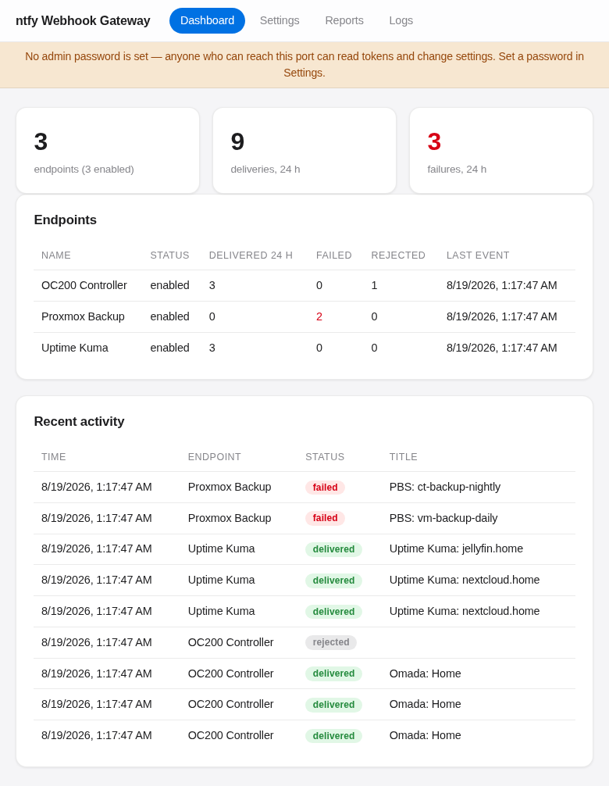
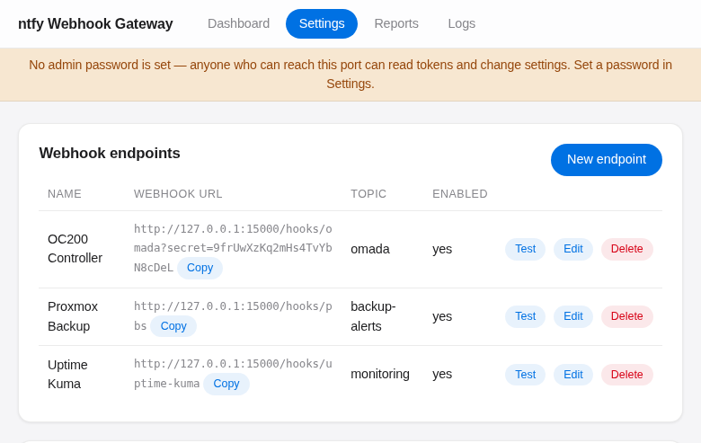
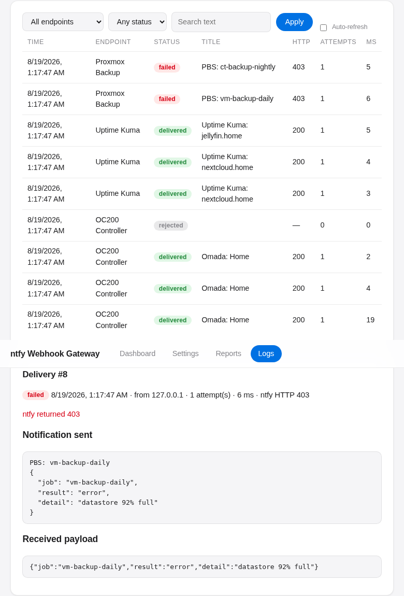
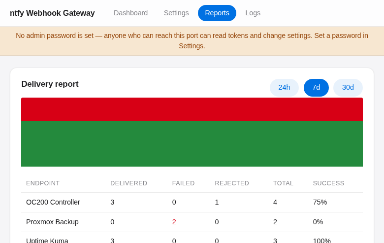

# ntfy Webhook Gateway

A generic webhook-to-[ntfy](https://ntfy.sh) gateway with a small web UI. It
receives HTTP POSTs from anything that can send a webhook — network
controllers, CI systems, monitoring tools, cron jobs — and forwards each
event as a push notification through your own ntfy server, with per-endpoint
templates, log history, and delivery reports.

## Features

- **Multiple endpoints** — each webhook source gets its own URL slug, ntfy
  topic, and template, all managed from the UI, with optional shared-secret
  authentication.
- **Template mapping with presets** — map arbitrary JSON payloads to a
  notification title, message, priority, and tags; start from a built-in
  preset (generic JSON, TP-Link Omada) or write your own.
- **Hot-reloaded settings** — endpoints and global settings live in SQLite
  and are read fresh on every request, so changes in the UI take effect
  immediately with no restart.
- **Per-delivery logs and reports** — every delivery attempt is recorded
  with its status, ntfy response, and timing; the Reports tab summarizes
  success rates and volume over 24h/7d/30d.
- **Dual ports for safe exposure** — the webhook receiver and the admin UI
  are separate listeners, so you can expose only the webhook port publicly.
- **Multi-arch container image** — published to GitHub Container Registry
  for `linux/amd64` and `linux/arm64`.

## Screenshots



| Endpoint settings with presets and shared secrets | Delivery logs with per-attempt detail |
|---|---|
|  |  |



## Origin: from Omada webhook to generic gateway

This project started as a ~60-line Flask proxy with one job: turn **TP-Link
Omada controller webhook** alerts (OC200/OC300/software controller) into
**ntfy push notifications** on a self-hosted ntfy server. That single-purpose
proxy grew into the generic **webhook-to-ntfy gateway** you see here — but
Omada support remains first-class:

- A built-in **Omada preset** maps the controller's webhook payloads (the
  `text` event lines with `description` fallback, plus legacy `event.*`
  formats) to clean notifications, with log-level → priority rules.
- Omada's native **Shard Secret** works out of the box: the gateway accepts
  the shared secret from the JSON body (`shardSecret`), a `?secret=` URL
  parameter, or an `X-Webhook-Secret` header.
- The legacy `/omada-webhook` path still works, and webhook responses are
  `200 OK` so the controller's built-in webhook test reports success.

If you found this repo searching for a way to get Omada alerts into ntfy:
that's exactly where it began — and it now handles Uptime Kuma, Proxmox,
CI pipelines, cron jobs, and anything else that can POST a webhook, too.

## Quick start

```bash
mkdir ntfy-webhook-gateway && cd ntfy-webhook-gateway
curl -LO https://raw.githubusercontent.com/tekgnosis-net/ntfy-webhook-gateway/main/docker-compose.yml
docker compose up -d
```

Open `http://<host>:5001`, set an admin password, set your ntfy server URL in
Settings, create an endpoint, and point your service's webhook at
`http://<host>:5000/hooks/<slug>`.

## Ports

| Port | Purpose | Exposure |
|------|---------|----------|
| 5000 | Webhook receiver (`/hooks/<slug>`, legacy `/omada-webhook`) | Public, via your reverse proxy |
| 5001 | Admin UI and API (`/api/*`) | LAN-only — never proxy this publicly |

The two are separate listeners on purpose: the webhook port only ever
accepts inbound event POSTs, so exposing it to the internet through a
reverse proxy carries no risk to settings, logs, or ntfy tokens, which all
live behind the admin port instead.

See [`docs/install.md`](docs/install.md) for installation, `.env`
configuration, and reverse-proxy setup, and
[`docs/operations.md`](docs/operations.md) for day-to-day use: creating
endpoints, template syntax, logs, reports, and password recovery.

## Development

```bash
pip install -r requirements-dev.txt
pytest -q
DATA_DIR=/tmp/gw python -m app.main
```

The last command runs both listeners locally (webhook on `:5000`, admin UI
on `:5001`) against a throwaway SQLite database in `/tmp/gw`.

## License

This project is licensed under the GNU Affero General Public License v3.0
(AGPL-3.0) — see [LICENSE](LICENSE) for the full text.
